# Crustacean Monitoring System - Architecture Documentation

This document provides comprehensive visual documentation of the Crustacean Monitoring System architecture, data flows, and component interactions using Mermaid diagrams.

## Table of Contents

1. [System Overview](#system-overview)
2. [ML Pipeline Flow](#ml-pipeline-flow)
3. [Package Structure](#package-structure)
4. [Class Hierarchy](#class-hierarchy)
5. [Real-time Pipeline Architecture](#real-time-pipeline-architecture)
6. [Offline Pipeline Architecture](#offline-pipeline-architecture)
7. [Thread Communication](#thread-communication)
8. [Model Processing Details](#model-processing-details)
9. [Camera System](#camera-system)
10. [Hardware Monitoring](#hardware-monitoring)
11. [Configuration System](#configuration-system)
12. [Data Flow Diagrams](#data-flow-diagrams)

---

## System Overview

High-level overview of the entire Crustacean Monitoring System:

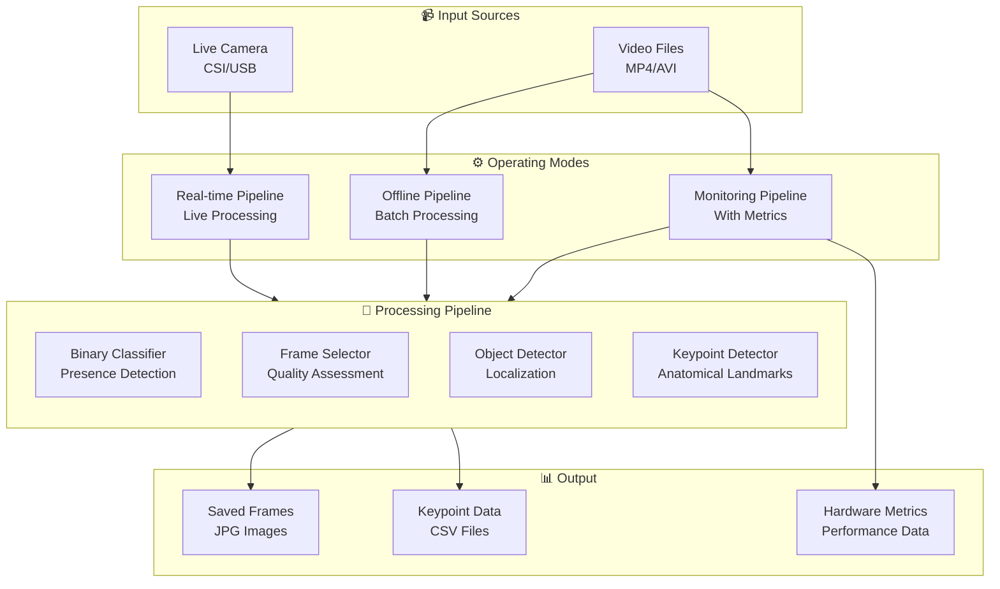

---

## ML Pipeline Flow

The 4-stage machine learning pipeline for crustacean detection:

```mermaid
flowchart LR
    subgraph Stage1["Stage 1: Binary Classification"]
        V1[Video Frames] --> BC[Binary Classifier<br/>TFLite Model]
        BC --> SIG[Binary Signal<br/>0/1 per frame]
        SIG --> SM[Smoothing &<br/>Rectification]
    end

    subgraph Stage2["Stage 2: Frame Selection"]
        SM --> FS[Frame Selector<br/>Top + Bottom Models]
        FS --> IDX[Best Frame<br/>Indices]
    end

    subgraph Stage3["Stage 3: Object Detection"]
        IDX --> EXT[Extract<br/>Frames]
        EXT --> OD[Object Detector<br/>YOLO-style]
        OD --> ROI[Cropped ROI<br/>+ Confidence]
    end

    subgraph Stage4["Stage 4: Keypoint Detection"]
        ROI --> KD[Keypoint Detector<br/>7 Landmarks]
        KD --> KP[Keypoint<br/>Coordinates]
    end

    KP --> OUT[Output:<br/>CSV + Images]

    style Stage1 fill:#e1f5fe
    style Stage2 fill:#fff3e0
    style Stage3 fill:#e8f5e9
    style Stage4 fill:#fce4ec
```

---

## Package Structure

Organization of the `crustacean` Python package:

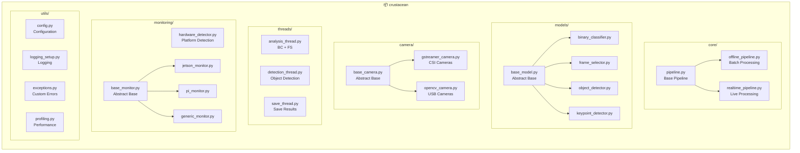

---

## Class Hierarchy

Inheritance relationships between classes:

```mermaid
classDiagram
    class Pipeline {
        <<abstract>>
        +config: Config
        +profiler: PerformanceProfiler
        +models: Dict
        +run()*
        +load_models()
        +cleanup()
    }
    
    class OfflinePipeline {
        +video_dir: Path
        +run()
        -_process_video()
    }
    
    class RealtimePipeline {
        +display_mode: bool
        +camera: BaseCamera
        +threads: Dict
        +run()
        -_main_loop()
    }
    
    Pipeline <|-- OfflinePipeline
    Pipeline <|-- RealtimePipeline

    class BaseModel {
        <<abstract>>
        +config: Config
        +interpreter: TFLite
        +load()*
        +predict()
        +unload()
        +preprocess()*
        +postprocess()*
    }
    
    class BinaryClassifier {
        +predict(video)
        -_smooth_signal()
    }
    
    class FrameSelector {
        +top_interpreter
        +bottom_interpreter
        +predict(signal, video)
    }
    
    class ObjectDetector {
        +confidence_threshold
        +predict(frame)
        -_crop_roi()
    }
    
    class KeypointDetector {
        +num_keypoints: 7
        +predict(roi_frames)
    }
    
    BaseModel <|-- BinaryClassifier
    BaseModel <|-- FrameSelector
    BaseModel <|-- ObjectDetector
    BaseModel <|-- KeypointDetector

    class BaseCamera {
        <<abstract>>
        +config: Config
        +open()*
        +read()*
        +release()*
    }
    
    class GStreamerCamera {
        +pipeline: str
        +open()
        +read()
    }
    
    class OpenCVCamera {
        +device: str
        +open()
        +read()
    }
    
    BaseCamera <|-- GStreamerCamera
    BaseCamera <|-- OpenCVCamera

    class BaseMonitor {
        <<abstract>>
        +interval: float
        +output_file: str
        +run()
        +stop()
        +collect_metrics()*
    }
    
    class JetsonMonitor {
        +collect_metrics()
    }
    
    class RaspberryPiMonitor {
        +collect_metrics()
    }
    
    class GenericMonitor {
        +collect_metrics()
    }
    
    BaseMonitor <|-- JetsonMonitor
    BaseMonitor <|-- RaspberryPiMonitor
    BaseMonitor <|-- GenericMonitor
```

---

## Real-time Pipeline Architecture

Multi-threaded architecture for live camera processing:

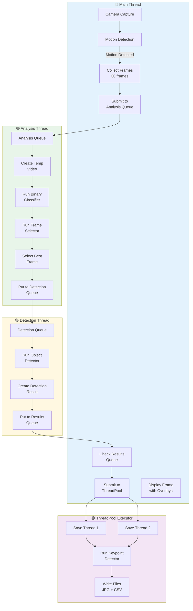

---

## Offline Pipeline Architecture

Sequential batch processing for video files:

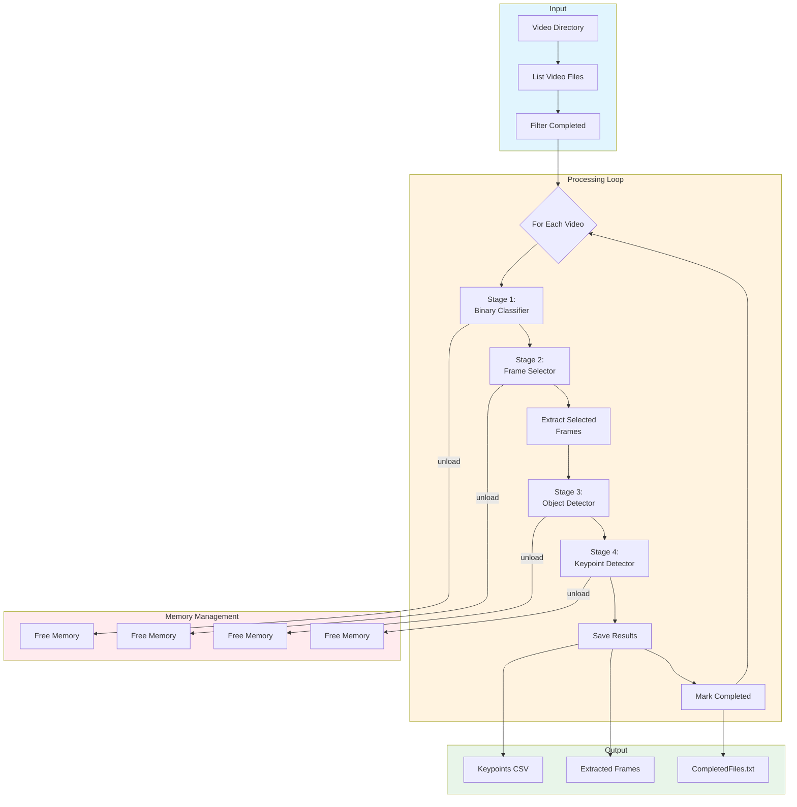

---

## Thread Communication

Queue-based communication between threads:

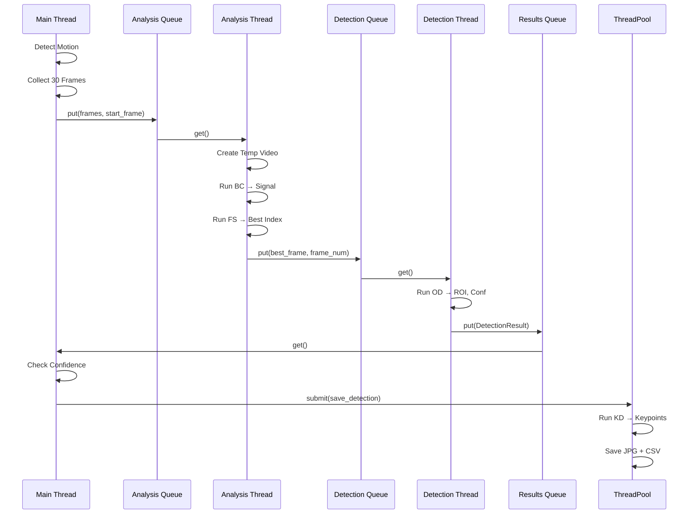

---

## Model Processing Details

### Binary Classifier Processing

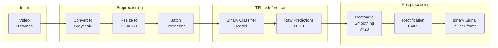

### Object Detector Processing

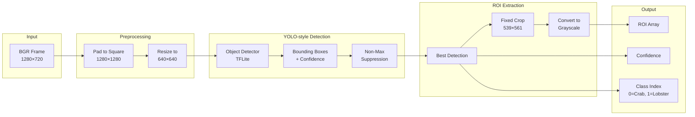

### Keypoint Detection

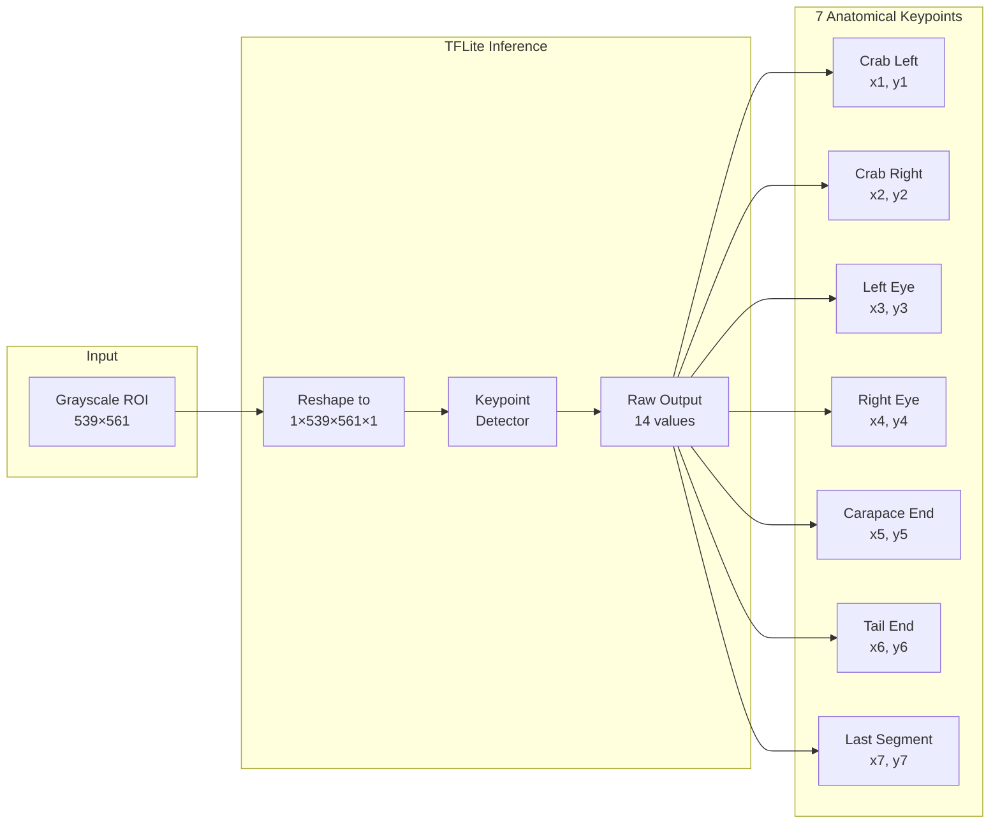

---

## Camera System

Camera initialization and frame capture:

```mermaid
flowchart TB
    subgraph Factory["Camera Factory"]
        CFG[Config:<br/>camera.type]
        CFG -->|csi| GST[GStreamerCamera]
        CFG -->|usb| OCV[OpenCVCamera]
    end

    subgraph GStreamer["GStreamer Pipeline (CSI)"]
        direction LR
        SRC[nvarguscamerasrc] --> CONV[nvvidconv]
        CONV --> FLIP[videoflip<br/>rotate-180]
        FLIP --> BGR[BGRx → BGR]
        BGR --> SINK[appsink]
    end

    subgraph OpenCV["OpenCV Capture (USB)"]
        direction LR
        DEV[/dev/video0] --> CAP[VideoCapture]
        CAP --> PROPS[Set Properties<br/>W×H, FPS]
        PROPS --> READ[read()]
    end

    GST --> GStreamer
    OCV --> OpenCV

    subgraph Output["Frame Output"]
        SINK --> FRAME[BGR Frame<br/>numpy array]
        READ --> FRAME
    end

    style Factory fill:#e1f5fe
    style GStreamer fill:#fff3e0
    style OpenCV fill:#e8f5e9
```

---

## Hardware Monitoring

Platform-specific hardware monitoring:

```mermaid
flowchart TB
    subgraph Detection["Platform Detection"]
        CHECK[detect_hardware()]
        CHECK -->|/etc/nv_tegra_release| JETSON[Jetson]
        CHECK -->|/proc/device-tree/model<br/>contains 'raspberry'| PI[Raspberry Pi]
        CHECK -->|default| GENERIC[Generic]
    end

    subgraph Monitors["Monitor Types"]
        JETSON --> JM[JetsonMonitor<br/>jtop integration]
        PI --> PM[PiMonitor<br/>vcgencmd]
        GENERIC --> GM[GenericMonitor<br/>psutil only]
    end

    subgraph Metrics["Collected Metrics"]
        direction TB
        COMMON[Common Metrics<br/>CPU %, RAM %, Timestamp]
        
        JM --> J_METRICS[Jetson Specific<br/>GPU %, GPU Temp<br/>CPU Temp, Power]
        PM --> P_METRICS[Pi Specific<br/>CPU Temp<br/>Throttle Status]
        GM --> G_METRICS[Generic<br/>CPU Temp if available]
    end

    subgraph Output["Output"]
        J_METRICS --> CSV[metrics.csv]
        P_METRICS --> CSV
        G_METRICS --> CSV
        COMMON --> CSV
    end

    style Detection fill:#e1f5fe
    style Monitors fill:#fff3e0
    style Metrics fill:#e8f5e9
```

---

## Configuration System

YAML configuration with environment variable overrides:

```mermaid
flowchart TB
    subgraph Sources["Configuration Sources"]
        YAML[config/default_config.yaml]
        CUSTOM[Custom YAML File]
        ENV[Environment Variables<br/>CRUSTACEAN_*]
    end

    subgraph Loading["Config Loading"]
        YAML --> LOAD[Config.load()]
        CUSTOM --> LOAD
        LOAD --> MERGE[Merge with<br/>Defaults]
        ENV --> OVERRIDE[Override<br/>Values]
        MERGE --> OVERRIDE
    end

    subgraph Sections["Configuration Sections"]
        direction TB
        MODELS[models:<br/>BC, FS, OD, KD paths]
        CAMERA[camera:<br/>type, resolution, fps]
        REALTIME[realtime:<br/>thresholds, intervals]
        OUTPUT[output:<br/>directories]
        LOGGING[logging:<br/>level, format]
        MONITORING[monitoring:<br/>interval, metrics]
    end

    OVERRIDE --> MODELS
    OVERRIDE --> CAMERA
    OVERRIDE --> REALTIME
    OVERRIDE --> OUTPUT
    OVERRIDE --> LOGGING
    OVERRIDE --> MONITORING

    subgraph Access["Accessing Config"]
        GET[config.get<br/>'models.object_detector.confidence_threshold']
        DOT[Dot Notation<br/>Nested Access]
        DEFAULT[Default Values<br/>if key missing]
    end

    MODELS --> GET
    GET --> DOT
    GET --> DEFAULT

    style Sources fill:#e1f5fe
    style Loading fill:#fff3e0
    style Sections fill:#e8f5e9
    style Access fill:#fce4ec
```

---

## Data Flow Diagrams

### Complete Real-time Data Flow

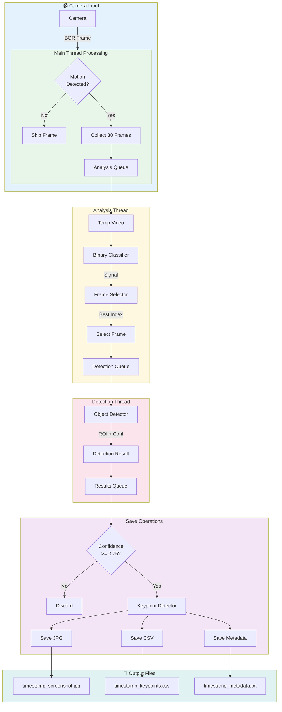

### Offline Pipeline Data Flow

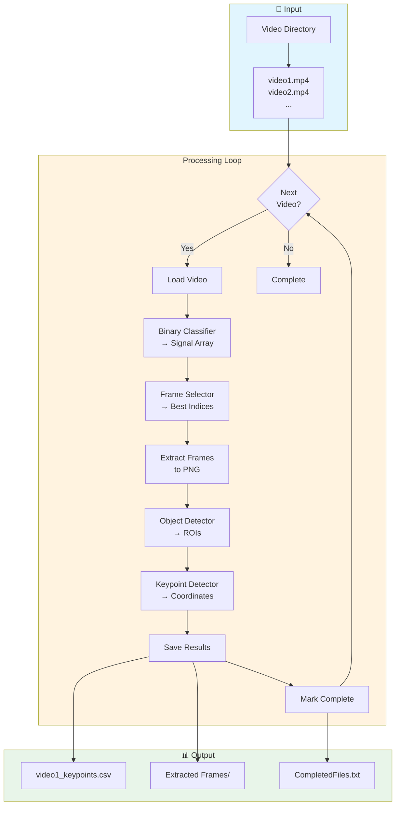

---

## State Diagrams

### Real-time Pipeline States

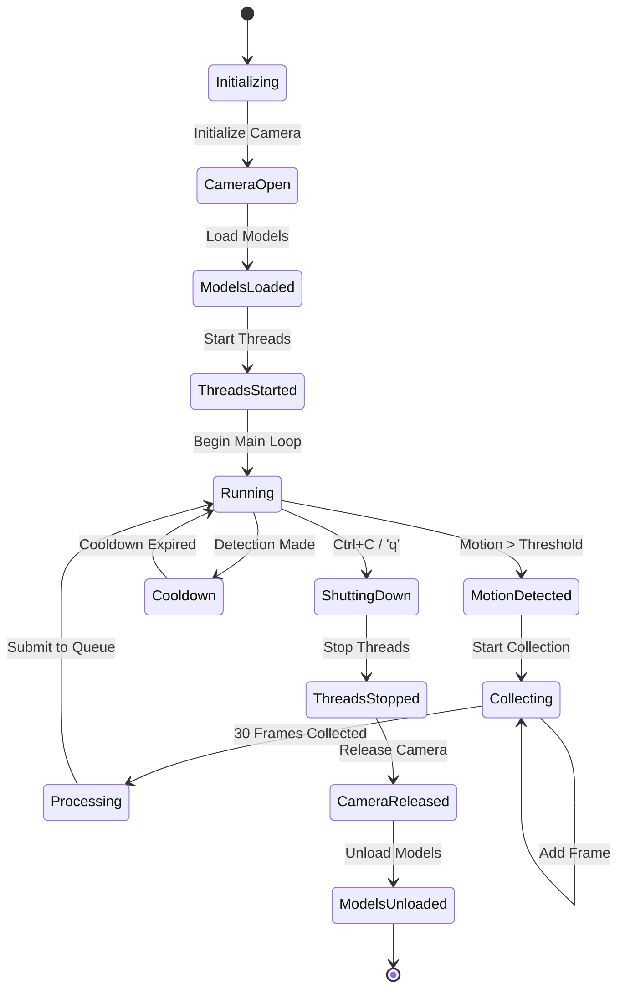

### Model Lifecycle

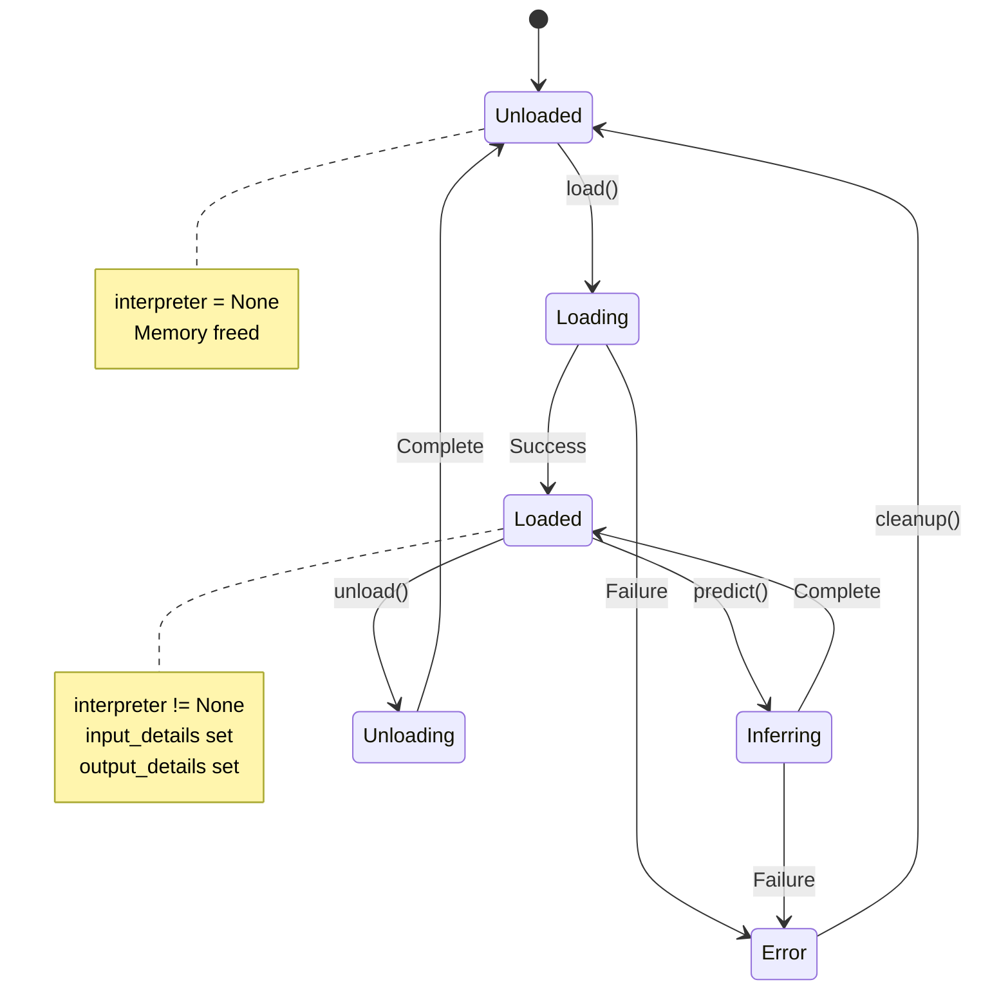

---

## Deployment Diagram

### Native Deployment

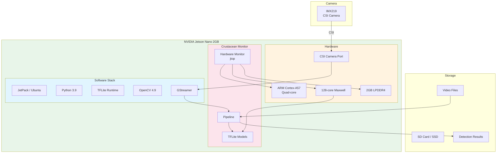

### Docker Deployment (Recommended)

```mermaid
flowchart TB
    subgraph JetsonNano["NVIDIA Jetson Nano"]
        subgraph Host["Host System"]
            DOCKER[Docker Engine]
            NVIDIA_RT[NVIDIA Container Runtime]
            CAMERA_DEV[/dev/video0]
        end
        
        subgraph Container["Docker Container"]
            subgraph BaseImage["L4T ML Base Image"]
                CUDA[CUDA + cuDNN]
                OPENCV[OpenCV with CUDA]
                PYTHON[Python 3.9]
            end
            
            subgraph App["Crustacean Monitor"]
                PIPELINE[Pipeline]
                MODELS[TFLite Models]
            end
        end
        
        subgraph Volumes["Mounted Volumes"]
            CONFIG[./config]
            LOGS[./logs]
            OUTPUT[./realtime_frames]
            VIDEO[./processing/video]
        end
    end

    NVIDIA_RT --> Container
    CAMERA_DEV --> Container
    CONFIG --> App
    LOGS --> App
    OUTPUT --> App
    VIDEO --> App

    style Host fill:#e1f5fe
    style Container fill:#e8f5e9
    style Volumes fill:#fff3e0
```

---

## Summary

This architecture documentation covers:

| Component | Description |
|-----------|-------------|
| **ML Pipeline** | 4-stage detection: BC → FS → OD → KD |
| **Operating Modes** | Real-time, Offline, Monitoring |
| **Threading** | Multi-threaded real-time with queues |
| **Camera Support** | CSI (GStreamer) and USB (OpenCV) |
| **Hardware Monitoring** | Jetson, Raspberry Pi, Generic |
| **Configuration** | YAML-based with env var overrides |

The system is optimized for edge deployment on NVIDIA Jetson Nano 2GB, processing live camera feeds or batch video files to detect and analyze crustaceans (crabs and lobsters) using deep learning models.
